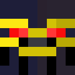

# 🐒 MonkeyCraft

### *Play Minecraft from anywhere. Really anywhere.*

**Stream and control your Minecraft game from your phone**

---

iOS client is available in TestFlight and has passed Beta Review by Apple App Store Connect. Android client is clear for closed testing. Please refer to the [wiki](https://github.com/weikengchen/monkeycraft/wiki) for the latest client release information. 

---

## ✨ What Can You Do?

MonkeyCraft lets you **play Minecraft remotely** from your iOS or Android phone. 

🎮 **Imagine these scenarios:**

- 🛋️ **Couch Gaming** — Keep playing while someone else uses the computer
- 🚇 **On the Go** — Continue your world from your phone during commute
- 🏠 **Around the House** — Check on your farm or AFK fishing from anywhere
- 👥 **Share Your Game** — Let a friend play on your world from their phone

---

## 🎯 Features

### 📹 Live Video Streaming

Watch your Minecraft game in real-time on your phone with:

| Setting | Options |
|---------|---------|
| 📐 Resolution | Low, Medium, High |
| 🎨 Color Mode | Normal, High Performance, Retro, Grayscale |
| ⚡ FPS | 1–20 frames per second |

### 🕹️ Touch Controls

Full gameplay control with intuitive touch interface:

| Control | Action |
|---------|--------|
| 🕹️ **Virtual Joystick** | Move around (WASD) |
| 👆 **Look Pad** | Look around by dragging + tap to click |
| 🦘 **Jump Button** | Jump (Space) |
| 🦆 **Sneak Button** | Sneak/crouch (Shift) |
| 🔢 **Hotbar** | Select items in your hotbar |
| 🧭 **Auto-Face Movement** | Optional: Automatically face movement direction |

### 💬 Chat System

- 📨 **Send Messages** — Chat with other players on the server
- 📥 **Receive Messages** — See all incoming chat with rich formatting
- 🔗 **Click Links** — Tap on links and commands in chat

### 🔔 Smart Notifications

Stay informed even when not actively playing:

| Type | Description |
|------|-------------|
| ⏰ **Timed Notification** | Get reminded at a specific time with countdown |
| 📳 **Instant Nudge** | Receive immediate alerts from in-game events |

### 😴 Hibernation Mode

Need to step away but stay connected?

- ⏸️ **Pause Streaming** — Stops video to save bandwidth
- 🔗 **Keep Connection** — Stays logged in to the server
- 💬 **Chat Available** — Still send and receive messages
- 📱 **Live Activity (iOS)** — See countdown on your lock screen

### 🔐 Secure Connection

- 🛡️ **Password Protected** — Only those with your password can connect
- 🔒 **HMAC Authentication** — Cryptographic challenge-response
- 🌐 **Network Control** — Restrict to localhost, local network, or anywhere
- 📱 **QR Code Setup** — Quick scan to enter password

---

## 🎮 How It Works

### 1️⃣ Install the Mod

Install the MonkeyCraft mod on your **Fabric** Minecraft client (version 26.1+).

### 2️⃣ Start the Server

In Minecraft, type `/monkey start` to launch the WebSocket server.

### 3️⃣ Connect Your Phone

Open the MonkeyCraft app on your phone and:
- Enter your computer's IP address and port (default: 9600)
- Scan the QR code displayed in-game, or
- Enter the password manually

### 4️⃣ Play!

Your Minecraft view appears on your phone. Use the touch controls to move, look, jump, and interact with the world.

---

## ⚙️ Configuration Options

Access settings via `/monkey config` or through ModMenu:

| Option | Default | What It Does |
|--------|---------|--------------|
| 🚪 **Port** | 9600 | The port number for connections |
| 🔑 **Password** | Random | Your connection password |
| 🌍 **Allow Connections From** | Local Network | Who can connect |
| ✅ **Command Allowlist** | All allowed | Which commands can be run remotely |
| ❌ **Command Denylist** | op, deop | Blocked commands |
| 🚀 **Auto-Launch** | Off | Start server automatically when joining a world |

---

## 📋 In-Game Commands

| Command | Description |
|---------|-------------|
| `/monkey` | Show help |
| `/monkey start` | Start the WebSocket server |
| `/monkey stop` | Stop the server |
| `/monkey ip` | Show your IP addresses |
| `/monkey config` | Open settings screen |

---

## 📱 App Screens

| Screen | Purpose |
|--------|---------|
| 🔐 **Login** | Enter server details and password |
| 📹 **Stream** | Main gameplay with video and controls |
| 💬 **Chat** | Dedicated chat interface |
| ⚙️ **Settings** | Adjust video quality and preferences |

---

## 🚀 Getting Started

### Requirements

| Component | Requirement |
|-----------|-------------|
| 🎮 Minecraft | Version 26.1+ |
| 📦 Mod Loader | Fabric |
| ☕ Java | 25+ |
| 📱 Phone | iOS or Android |

### Install Steps

1. **Install Fabric** — Download from [fabricmc.net](https://fabricmc.net/use/)
2. **Download MonkeyCraft** — Get the mod JAR
3. **Install Mod** — Place in your `mods` folder
4. **Get the App** — Download on your phone
5. **Connect & Play!**

---

## ❓ FAQ

### Can I play on a server?

Yes! MonkeyCraft streams your Minecraft client, so you can play on any server or singleplayer world.

### Is there lag?

Video is encoded and streamed in real-time. For best results:
- Use a strong WiFi connection
- Lower resolution/FPS if needed
- Keep your computer close to your router

### Can multiple phones connect?

Only one phone can connect at a time.

### Does it work over the internet?

By default, connections are restricted to your local network. You can enable internet access in settings, but proceed with caution.

### What commands can I run remotely?

By default, all commands are allowed except `op` and `deop`. Configure allowlist/denylist in settings.

---

**Made with ❤️ by [weikengchen](https://github.com/weikengchen)**

